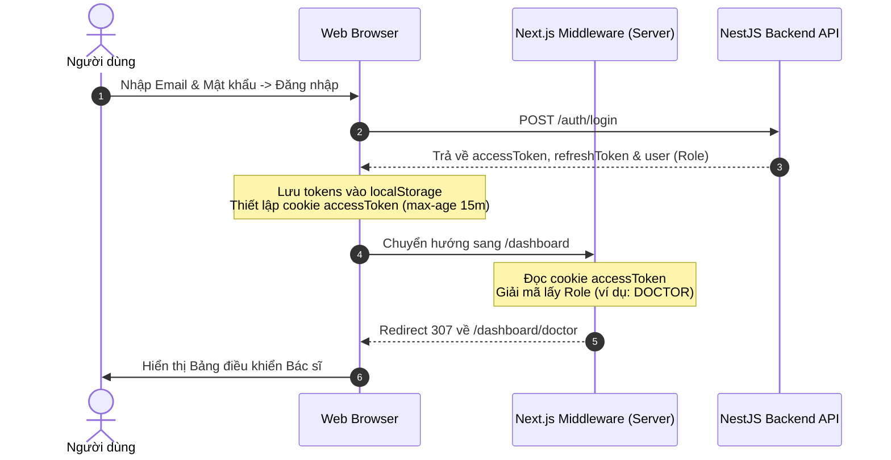

# Tài liệu Kiến trúc Xác thực & Phân quyền Frontend (Auth & RBAC)

Tài liệu này hướng dẫn cách hệ thống xác thực (Authentication) và phân quyền vai trò (Role-Based Access Control - RBAC) hoạt động trong ứng dụng Frontend Next.js (App Router).

---

## 1. Sơ đồ Luồng Hoạt động (Workflow)



---

## 2. Các Thành phần Hệ thống chính

### 2.1. Next.js Middleware (`frontend/middleware.ts`)
- **Vai trò**: Chạy ở tầng Edge (phía Server) trước khi render bất kỳ trang nào nhằm bảo mật và kiểm soát truy cập cấp độ Route.
- **Hoạt động**:
  1. Đọc cookie `accessToken`.
  2. Giải mã bằng hàm `decodeJwtPayload` để lấy các thông tin: `role`, `email`, `sub` (ID người dùng).
  3. Áp dụng các luật phân quyền:
     - **Chưa đăng nhập**: Cố gắng truy cập `/dashboard/:path*` -> Chuyển hướng về `/login`.
     - **Đã đăng nhập**: Cố gắng truy cập `/login` -> Chuyển hướng về trang dashboard tương ứng với vai trò của tài khoản.
     - **Truy cập `/dashboard`**: Tự động chuyển tiếp (Role Redirect) đến đúng trang vai trò (ví dụ: `/dashboard/patient`).
     - **Truy cập chéo quyền**: Ví dụ bệnh nhân gõ tay `/dashboard/admin` -> Middleware phát hiện vai trò không khớp và đưa người dùng về đúng trang `/dashboard/patient`.

### 2.2. Đồng bộ Cookie khi Silent Refresh (`frontend/lib/api.ts`)
- **Vấn đề ban đầu**: Khi access token hết hạn ở Client, Axios Response Interceptor tự động gọi `/auth/refresh` và cập nhật `localStorage`. Tuy nhiên, vì cookie `accessToken` không được cập nhật, Middleware phía Server vẫn giữ giá trị cũ (hoặc hết hạn), dẫn đến việc tải lại trang sẽ đẩy người dùng về `/login`.
- **Giải pháp**: Trong Response Interceptor của `api.ts`, sau khi nhận được `accessToken` mới từ backend, chúng ta tiến hành ghi đè cookie:
  ```typescript
  document.cookie = `accessToken=${newAccessToken}; path=/; max-age=900; SameSite=Lax;`;
  ```
  Điều này đồng bộ lập tức phiên đăng nhập giữa Client (LocalStorage, Axios Headers) và Server (Next.js Middleware).

### 2.3. Cấu trúc Layout Xác thực chung (`frontend/app/(auth)/layout.tsx`)
- Gom cụm các trang xác thực (như `/login` hay `/register` sau này) vào Route Group `(auth)`.
- Layout chứa hiệu ứng thiết kế cao cấp: các Orbs phát sáng nhấp nháy, khung card mờ (glassmorphism), viền gradient chạy động, và header Clinic thương hiệu đồng nhất. Trang `/login/page.tsx` giờ đây chỉ tập trung vào mã nguồn form đăng nhập.

### 2.4. Dashboard Shell Layout (`frontend/app/dashboard/layout.tsx`)
- Layout chung cho tất cả các trang Dashboard vai trò.
- Đọc thông tin người dùng từ `localStorage` để hiển thị lời chào cá nhân hóa.
- Tự động thay đổi danh sách Menu bên trái (Sidebar) theo vai trò hiện tại của tài khoản:
  - **ADMIN**: Tổng quan, Quản lý tài khoản, Nhật ký hoạt động, Cấu hình.
  - **DOCTOR**: Lịch khám bệnh, Hàng đợi khám, Hồ sơ bệnh án.
  - **RECEPTIONIST**: Quầy tiếp đón, Xếp hàng & Điều phối, Đặt lịch hẹn mới.
  - **PATIENT**: Lịch hẹn của tôi, Đặt lịch khám mới, Lịch sử khám bệnh.
- Hỗ trợ menu rút gọn cho thiết bị di động (Mobile Responsive Drawer) và cơ chế Đăng xuất an toàn (gọi API logout backend + xóa cookie/localStorage).

---

## 3. Cách thêm Trang Bảo mật hoặc Dashboard mới

1. **Thêm trang chức năng con**:
   - Nếu bạn muốn thêm trang quản lý lịch khám của bác sĩ tại đường dẫn `/dashboard/doctor/schedule`, hãy tạo thư mục mới `frontend/app/dashboard/doctor/schedule` và tạo file `page.tsx` bên trong.
   - Do nằm dưới thư mục `/dashboard/doctor`, trang này sẽ tự động:
     - Kế thừa giao diện Sidebar và Profile Header từ `dashboard/layout.tsx`.
     - Được bảo vệ bởi Middleware (chỉ cho phép tài khoản có vai trò `DOCTOR` truy cập).

2. **Thêm vai trò mới (ví dụ: `PHARMACIST` - Dược sĩ)**:
   - Cập nhật định nghĩa Menu trong `dashboard/layout.tsx`, bổ sung trường hợp `case 'PHARMACIST'`.
   - Tạo thư mục `frontend/app/dashboard/pharmacist` và tạo file `page.tsx` làm màn hình chính.
   - Cập nhật danh sách các vai trò được phép (`allowedRoles`) trong `frontend/middleware.ts` để Middleware tự động điều hướng chính xác.
